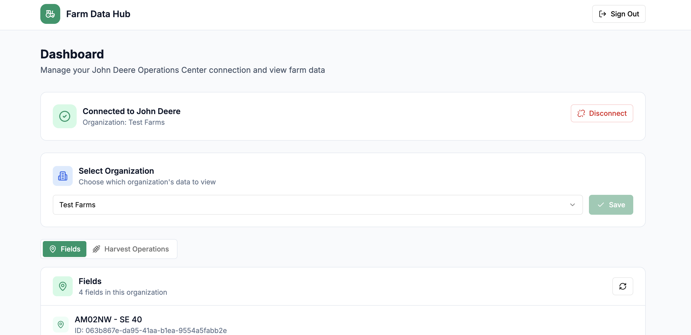

# Farm Data Hub

A demo web app that connects to the **John Deere Operations Center API** to display farm data — fields, organizations, and harvest operations — all behind a Supabase-powered auth layer.



---

## What it does

1. Users sign in or create an account (Supabase Auth).
2. They connect their John Deere Operations Center account via OAuth 2.0.
3. They pick an organization and browse **fields** and **harvest operations** pulled live from the John Deere API.

## Tech stack

| Layer | Technology |
|-------|-----------|
| Frontend | Next.js 13 (App Router), React, Tailwind CSS, shadcn/ui |
| Backend | Supabase Edge Functions (Deno) |
| Database | Supabase (PostgreSQL) |
| Auth | Supabase Auth (email/password) + John Deere OAuth 2.0 |
| Hosting | Bolt (current) · Netlify (ready via `netlify.toml`) |

## Project structure

```
app/                    # Next.js pages
  page.tsx              # Root redirect (→ /login or /dashboard)
  login/page.tsx        # Sign-in / sign-up form
  dashboard/page.tsx    # Main dashboard
  auth/callback/page.tsx# John Deere OAuth callback handler

components/dashboard/   # Dashboard UI components
  john-deere-connect.tsx
  organization-selector.tsx
  fields-list.tsx
  harvest-operations.tsx

contexts/
  auth-context.tsx      # Auth state + John Deere connection state

lib/
  supabase.ts           # Supabase client
  john-deere-client.ts  # API helper functions

supabase/
  functions/
    john-deere-auth/    # Edge Function: OAuth token exchange / refresh / disconnect
    john-deere-api/     # Edge Function: Organizations, fields, harvest operations
  migrations/           # Database schema (john_deere_connections table)

types/
  database.ts           # Supabase table types
  john-deere.ts         # John Deere API response types
```

## Environment variables

### Next.js frontend (`.env.local`)

| Variable | Description |
|----------|-------------|
| `NEXT_PUBLIC_SUPABASE_URL` | Your Supabase project URL |
| `NEXT_PUBLIC_SUPABASE_ANON_KEY` | Supabase anonymous (public) API key |
| `NEXT_PUBLIC_JOHN_DEERE_CLIENT_ID` | John Deere OAuth application client ID |

### Supabase Edge Functions

Set these in the Supabase dashboard under **Project Settings → Edge Functions** or via the Supabase CLI:

| Variable | Description |
|----------|-------------|
| `JOHN_DEERE_CLIENT_ID` | John Deere OAuth application client ID |
| `JOHN_DEERE_CLIENT_SECRET` | John Deere OAuth application client secret |
| `SUPABASE_URL` | Auto-injected by Supabase runtime |
| `SUPABASE_SERVICE_ROLE_KEY` | Auto-injected by Supabase runtime |

## Local development

```bash
# Install dependencies
npm install

# Add environment variables
cp .env.local.example .env.local   # then fill in your values

# Run the dev server
npm run dev
```

Open [http://localhost:3000](http://localhost:3000).

### Other useful commands

```bash
npm run build      # Production build
npm run lint       # ESLint
npm run typecheck  # TypeScript type check (no emit)
```

## Deploying to Netlify

A `netlify.toml` is already configured. Connect your GitHub repo to Netlify and set the environment variables listed above in **Site settings → Environment variables**. Netlify will build and deploy automatically on every push.

## John Deere OAuth setup

1. Register an application at the [John Deere Developer Portal](https://developer.deere.com/).
2. Add **both** redirect URIs to your application:
   - `http://localhost:3000/auth/callback` (local development)
   - `https://<your-domain>/auth/callback` (production)
3. Request the scopes: `ag1 ag2 ag3 org1 org2 work1 work2 offline_access`.
4. Copy the client ID and secret into your environment variables.

> **Note:** The app currently targets the John Deere **sandbox** API (`sandboxapi.deere.com`). Switch the base URL in `supabase/functions/john-deere-api/index.ts` for production.

## Database

Run the migration to create the `john_deere_connections` table:

```bash
supabase db push
# or apply supabase/migrations/ manually in the Supabase SQL editor
```

The table stores one OAuth token record per user (RLS enforced — users can only access their own row).
